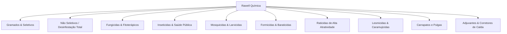

# 🧠 Megabrain 2.0 Expandida — Rawell Química (Oficial 2026)

Base de Conhecimento Master da **Rawell Química** (Campo Verde - MT, fundada em 2006).  
Compilação unificada integrando o **Catálogo Técnico Oficial 2026**, fichas de registro **ANVISA/Domissanitários**, bulas de produto, protocolos de aplicação e matriz de decisão para atendimento técnico e comercial.

---

## 🏢 1. Dados Institucionais & Filosofia de Fabricação

* **Razão Social:** Rawell Química Ltda - EPP
* **CNPJ:** 08.400.893/0001-74
* **Sede:** Campo Verde – Mato Grosso (Polo do Agronegócio Brasileiro).
* **Propósito & Posicionamento:**
  - Desenvolvimento de **produtos domissanitários e jardinagem amadora** de alta eficiência, com grau de segurança projetado para convívio com crianças e animais domésticos.
  - **Diferencial Toxicológico:** Formulações livres de **POEA** (*Polyethoxylated tallow amine* — surfactante cancerígeno comum em defensivos agrícolas brutos) e substituição de solventes agressivos por água (formulações **EW** e hidrossolúveis).
  - **Pesquisa em Fitoativos:** Utilização de sinergia entre biotecnologia e extratos botânicos tradicionais (Neem Indiano, Citronela, Alecrim, Alho, Calêndula, Marcela, Sucupira, Cravo-da-Índia).

---

## 📊 2. Arquitetura de Produtos por Categoria e Protocolo Técnico

---

### 🌿 LINHA 1: GRAMADOS & HERBICIDAS SELETIVOS

#### 01. Kapina Plus (60ml)
* **Classe:** Desinfestante seletivo sistêmico pós-emergente (Suspensão Concentrada - SC).
* **Alvos:** Folhas Largas (Amendoim Bravo, Avencas, Erva-de-Santa-Luzia, Quebra-Pedra Rasteiro, Trevos, Trapoeraba, Buva, Desmodium, Agriãozinho, Roseta e Cyperáceas).
* **Espécie de Grama Resistente:** Exclusivo para **Grama Esmeralda** (*Zoysia japonica*).
* **Contraindicações:** NUNCA aplicar em Grama Batatais, Sempre Verde (*Paspalum vaginatum*), São Carlos (*Axonopus compressus*), Santo Agostinho ou canteiros com plantas do gênero *Arachis* (amendoim forrageiro).
* **Estágio das invasoras:** Máxima eficiência em plantas daninhas com até 6 folhas ou ~10 cm de altura.
* **Intervalos & Segurança:** Mínimo de 2 horas sem chuva após aplicação; sintomas visíveis de 10 a 15 dias; reentrada de pessoas e pets após 24h.
* **Embalagem:** Frasco 60ml (Dose única) — Caixa c/ 60 frascos.

#### 02. Kapina Tradicional (60ml)
* **Classe:** Desinfestante seletivo para erradicação de Cyperáceas (Tiririca).
* **Alvos:** Tiriricas e ciperáceas em gramados de folhas estreitas.
* **Mecanismo:** Ação sistêmica profunda que desseca os **rizomas, tubérculos e bulbos subterrâneos ("batatinhas" e "cebolinhas")**, eliminando a reserva reprodutiva da praga sem provocar fitotoxicidade na grama.
* **Embalagem:** Frasco 60ml — Caixa c/ 60 frascos.

#### 03. Korsário (60ml)
* **Classe:** Desinfestante seletivo pós-emergente para controle de Rosetas.
* **Alvos:** Roseta (*Soliva pterosperma* / espinho de roseta).
* **Seletividade:** Seguro para **TODOS os tipos de gramados**.
* **Mecanismo:** Ação 200% — paralisa o crescimento e elimina 100% do sistema radicular e 100% da parte aérea espinhosa.
* **Embalagem:** Frasco 60ml — Caixa c/ 60 frascos.

#### 04. Katana (30ml)
* **Classe:** Herbicida seletivo inibidor da ALS para folhas estreitas/finas.
* **Alvos:** Capim Pé-de-Galinha (*Eleusine indica*), Capim Braquiária (*Brachiaria decumbens*), Capim Colchão (*Digitaria horizontalis*).
* **Seletividade:** Específico para **Grama Esmeralda** e **Grama Bermuda**.
* **Protocolo de Ouro:** **Aplicação obrigatória após as 16h00** (para máxima absorção estomática e evitar fitotoxicidade por calor excessivo).
* **Embalagem:** Frasco 30ml — Caixa c/ 60 frascos.

#### 05. Kcura Fungicida (100ml)
* **Classe:** Fungicida sistêmico de amplo espectro para gramados e plantas ornamentais.
* **Alvos:** Fungos de solo e aéreos, principalmente *Rhizoctonia*, queima foliar e podridões.
* **Modo de Usar / Diluição:** Diluir 100ml em 1 litro de água limpa e aplicar **16,67 ml da calda por m²** diretamente sobre a área infectada.
* **Embalagem:** Frasco 100ml — Caixa c/ 60 frascos.

---

### 🛑 LINHA 2: NÃO SELETIVOS (DESINFESTAÇÃO TOTAL / MATA-MATO)

#### 06. Roçada (100ml)
* **Função:** Desinfestante total sistêmico com ação **Pós e Pré-emergente**.
* **Aditivação:** Formulado com Óleo Mineral + Sulfato de Amônia + Espalhante Adesivo.
* **Diferencial:** **100% livre de POEA**. Mantém o solo limpo por até **90 dias**. Efeito gradativo e definitivo em até 25 dias.
* **Rendimento:** Média de 300 m² por frasco de 100ml.
* **Embalagem:** Frasco 100ml — Caixa c/ 60 frascos.

#### 07. ArranKa EW (100ml)
* **Função:** Emulsão aquosa (EW) para desinfestação urbana total de calçadas, pátios, muros e terrenos.
* **Aditivação:** Sulfato de Potássio + Espalhante adesivo de alta penetração. Sem POEA.
* **Rendimento:** 300 m² de cobertura.
* **Embalagem:** Frasco 100ml — Caixa c/ 60 frascos.

#### 08. ArranKa Pronto Uso (1 Litro)
* **Função:** Desinfestante não seletivo líquido pronto para pulverização direta sem necessidade de diluição prévia.
* **Rendimento:** Até 300 m² de área infestada.
* **Embalagem:** Frasco 1 Litro — Caixa c/ 12 frascos.

---

### 🌺 LINHA 3: FUNGICIDAS ORNAMENTAIS & FITOTERÁPICOS

#### 09. Bravick Fungicida Concentrado (10ml)
* **Função:** 1º do mercado em combate e prevenção de fungos patogênicos em plantas ornamentais, flores, orquídeas e folhagens de vaso.
* **Modo de Usar:** Agitar o produto, diluir 1 frasco (10ml) em 1 litro de água limpa até formar calda homogênea e pulverizar uniformemente nas folhas infectadas. Monitorar o jardim e remover partes mortas.
* **Embalagem:** Frasco 10ml — Caixa c/ 60 frascos.

#### 10. Bravick Pronto Uso Spray (240ml)
* **Função:** Versão spray de aplicação direta em gatilho para uso residencial rápido em orquídeas, folhagens e jardins verticais.
* **Embalagem:** Frasco 240ml c/ gatilho — Caixa c/ 24 frascos.

#### 11. Ka-Bio Fitoterápico Natural (60ml)
* **Função:** Inseticida/repelente fitoterápico para controle de mastigadores, raspadores e sugadores (pulgões, lagartas, cochonilhas, tripes).
* **Composição Botânica:** Extratos de Alecrim, Alho, Calêndula, Citronela, Cravo da Índia, Fumo, Marcela, Pimenta do Reino, Pimenta Malagueta, Sucupira, Óleo de Rícino, Álcool de Cereais e Isasofrol.
* **Modo de Preparo Tradicional:** Previamente diluir bem 1 colher de sopa de sabão em pó em 1 litro de água limpa (formando o agente surfactante/emulsionante); adicionar **5ml de Ka-Bio**, agitar bem e pulverizar diretamente sobre as pragas.
* **Embalagem:** Frasco 60ml — Caixa c/ 60 frascos.

#### 12. Ka-Bio Pronto Uso Spray (240ml)
* **Função:** Solução fitoquímica pronta para borrifar em vasos e hortas domésticas.
* **Embalagem:** Frasco 240ml c/ gatilho — Caixa c/ 24 frascos.

---

### 🕷️ LINHA 4: INSETICIDAS GERAIS & PRAGAS URBANAS

#### 13. Impakto Inseticida Pronto Uso (250ml e 500ml)
* **Pragas:** Aranhas, Baratas, Cupins, Formigas, Escorpiões e Pulgas.
* **Modo de Ação:** Ação deletéria sem efeito de choque instantâneo (o inseto não morre na hora, contaminando o restante do ninho); mortalidade efetiva a partir de 48 horas.
* **Aplicação:** Borrifar a uma distância de 20cm diretamente sobre fendas, ralos, caixas de gordura e trilhas. Não mancha superfícies e não tem cheiro.
* **Embalagens:** Frasco 250ml (Caixa c/ 24) e Frasco 500ml c/ gatilho (Caixa c/ 16).

#### 14. Fimo Combina Spray (40ml e 120ml)
* **Pragas:** Aranhas, Baratas, Cupins, Escorpiões e Formigas.
* **Diferencial:** **Formulado com atrativo** — não precisa atingir o inseto diretamente. O inseto é atraído à área pulverizada, caminha sobre a película e morre. Residual de até 6 meses.
* **Embalagens:** Frasco 40ml (Caixa c/ 60) e Frasco 120ml (Caixa c/ 30).

#### 15. Pankada Multi-Insetos (30ml, 60ml, 250ml)
* **Pragas:** Ácaros, Barata Germânica, Bicudo, Cascudinho, Mosca-Branca, Larva-Mineradora, Pulgões, Tribólio e Tripes.
* **Modo de Usar / Dosagem:** Diluir **3ml por litro de água limpa**. Pulverizar **10ml/m²** nas superfícies e abrigos das pragas. Residual de até 180 dias.
* **Embalagens:** Frasco 30ml (Caixa c/ 120), Frasco 60ml (Caixa c/ 60) e Frasco 250ml (Caixa c/ 20).

#### 16. UNIX Repik (30ml)
* **Pragas:** Inseticida para ambientes domésticos contra baratas, cupins e formigas resistentes.
* **Embalagem:** Frasco 30ml em display com 30 unidades.

#### 17. ArranKa SPM Saúde (Sachês Hidrossolúveis 10g)
* **Pragas:** Formiga Lava-Pés (*Solenopsis invicta*), Cochonilhas, Pulgões, Escorpiões, Aranhas e Baratas.
* **Uso & Diluição:** Diluir 1 sachê de 10g em **10 litros de água limpa**. Aplicar **30 ml de calda por metro quadrado**.
* **Embalagens:** Envelope com 3 sachês de 10g (Display c/ 34 envelopes / Caixa c/ 4 displays) e Balde 1kg (100 sachês de 10g).

#### 18. ArranKa PM (Lambda-Cialotrina 10%)
* **Foco Especial:** Formulação concentrada em pó molhável hidrossolúvel para infestações severas de solo, canteiros e formiga lava-pés.
* **Modo de Usar:** Diluir 1 sachê em **1 litro de água limpa** e aplicar 30ml/m² sobre os focos.
* **Embalagem:** Envelope com 2 ou 3 sachês de 10g (Display c/ 34 envelopes / Caixa c/ 4 displays).

---

### 🪰 LINHA 5: MOSQUICIDAS & LARVICIDAS

#### 19. NaMosca GB (Sachê 20g e 50g)
* **Princípio Ativo:** Thiametoxam 1% + Atrativo Sexual (*Z-9-Tricosene*). Venda livre.
* **Modo de Usar:** 
  - Espalhar no piso: **3g por m²** (30g para cada 10m²).
  - Ou colocar em pequenos recipientes (2g a 5g cada) sobre batentes e muretas fora do alcance de pets e crianças.
  - Elimina adultos, larvas e pupas. Pode ser usado em esterqueiras e composteiras.
* **Embalagens:** Sachê 20g (Display c/ 30 / Caixa c/ 8 displays) e Sachê 50g (Display c/ 30).

#### 20. BleKalt 25 (Thiamethoxam 25%)
* **Indicação:** Granjas, laticínios, frigoríficos, haras e matadouros.
* **Métodos de Aplicação (Frasco 90g):**
  1. **Barbante:** Dissolver 30g em 300ml de água + 150g de açúcar cristal. Encharcar barbantes e pendurar horizontalmente a 2m do solo.
  2. **Pincelamento:** Dissolver 30g em 60ml de água + 30g de açúcar cristal. Pincelar em faixas de 10x30cm em superfícies ou placas de papelão suspensas.
  3. **Pulverização Localizada:** 30g em 200ml de água + 100g de açúcar.
  4. **Pulverização Total / Larvas:** 3g por litro de água limpa em lixeiras e caixas de gordura. Residual de 4 a 6 semanas.
* **Embalagens:** Frasco 90g (Display c/ 12) e Sachê 1kg (Caixa c/ 10 sachês).

#### 21. Koral Moscas (60ml)
* **Indicação:** Controle de moscas em restaurantes, padarias e residências.
* **Modo de Usar:**
  - Pulverização Total: Diluir **3ml por litro de água**.
  - Pincelamento: Diluir 20ml em 200ml de água.
* **Embalagem:** Frasco 60ml — Caixa c/ 60 frascos.

---

### 🐜 LINHA 6: FORMICIDAS & BARATICIDAS (GÉIS E ISCAS)

#### 22. Mata-Formiga Gel Indoxacarbe (Seringa 10g)
* **Pragas:** Formigas doceiras e caseiras (*Tapinoma*, *Monomorium*).
* **Mecanismo:** Ação por ingestão e trofalaxia (**Efeito Dominó**). As operárias levam o gel ao ninho, alimentam a rainha e exterminam toda a colônia em até 72 horas.
* **Embalagem:** Seringa aplicadora 10g — Caixa c/ 80 seringas.

#### 23. Mata-Barata Gel Imidacloprid (Seringa 10g)
* **Pragas:** Barata de Cozinha/Francesinha (*Blattella germanica*) e Barata de Esgoto (*Periplaneta americana*).
* **Mecanismo:** Ingestão + contaminação secundária por coprofagia/necrofagia no ninho. Elimina o foco em até 72 horas sem cheiro.
* **Embalagem:** Seringa aplicadora 10g — Caixa c/ 80 seringas.

#### 24. Mata-Formiga Isca Granulada Etiprole (50g)
* **Diferencial:** **1ª isca com Etiprole do mercado brasileiro**.
* **Pragas:** Específica para formigas cortadeiras (**Saúvas e Quenquéns**). Carregamento imediato para dentro dos olheiros.
* **Embalagem:** Sachê 50g — Pacote c/ 10 sachês.

---

### 🐀 LINHA 7: RATICIDAS DE ALTA PERFORMANCE

#### 25. K-Rato Soft-Bait (Isca Macia 150g e Balde 2kg)
* **Tipo:** Isca fresca anticoagulante de dose única.
* **Diferencial Único:** Formulada com **Gordura de Queijo**, proporcionando palatabilidade máxima mesmo em locais com alta competição de outros alimentos.
* **Alvos:** Ratos de esgoto, ratos de telhado e camundongos.
* **Embalagens:** Sachê 150g (Display c/ 16) e Balde 2kg (10 pacotes de 200g / Caixa c/ 4 baldes).

#### 26. K-Rato Pó de Contato (100g, 250g, 1kg)
* **Tipo:** Raticida anticoagulante em pó fino aderente.
* **Aplicação:** Aplicar uniformemente **40g do produto por metro linear** nas tocas, frestas, conduítes e trilhas (pontos a cada 5 metros).
* **Mecanismo:** Adere aos pelos e patas do roedor. Ao se limpar (hábito de autolimpeza), ele ingere a dose letal. Age a partir de 48h (permitindo contaminar a ninhada). O roedor desseca após a morte, minimizando mau cheiro. Não solúvel em água.
* **Embalagens:** Talqueiras polvilhadoras de 100g (Caixa c/ 40), 250g (Caixa c/ 40) e 1kg (Caixa c/ 10).

---

### 🐌 LINHA 8: LESMICIDAS & CARAMUJICIDAS

#### 27. Karamujo Garden (Sachê 30g)
* **Indicação:** 1ª isca lesmicida registrada para **Jardinagem Amadora**.
* **Diferencial:** Grânulos com **Bórax**, resistentes à chuva e umidade.
* **Dosagem:** Espalhar **4g por metro quadrado** nos canteiros e vasos no final da tarde (hábito noturno dos moluscos).
* **Embalagem:** Sachê 30g (Display c/ 30 / Caixa c/ 8 displays).

#### 28. Karamujo Metaldeído Pellets (200g e 1kg)
* **Indicação:** Grandes ambientes, quintais e combate ao **Caramujo Africano** (*Achatina fulica*). Pellets de alta durabilidade externa.
* **Embalagens:** Sachê 200g (Caixa c/ 30) e Sachê 1kg (Caixa c/ 10).

---

### 🐾 LINHA 9: CONTROLE DE CARRAPATOS E PULGAS

#### 29. Koral Carrapatos e Pulgas Concentrado (60ml)
* **Ação Completa:** Adulticida, **Ovicida e Larvicida** (quebra integralmente as 4 fases do ciclo biológico).
* **Dosagem:** Diluir **3ml por litro de água limpa** e pulverizar todas as áreas frequentadas pelos animais (canis, muros, grama, rodapés).
* **Segurança:** Não oferece riscos a cães, gatos e pessoas após a secagem da calda.
* **Embalagem:** Frasco 60ml — Caixa c/ 60 frascos.

#### 30. Koral Pronto Uso Spray (240ml)
* **Aplicação:** Versão spray de aplicação direta em frestas, casinhas de animais, tapetes e rodapés.
* **Embalagem:** Frasco 240ml c/ gatilho — Caixa c/ 24 frascos.

---

### 🧪 LINHA 10: ADJUVANTES & CORRETORES DE CALDA

#### 31. Redutor de pH e Sequestrante p/ Águas Duras (100ml)
* **Função:** Neutraliza cátions livres (cálcio, magnésio) e carbonatos presentes em águas duras/poço artesiano, corrigindo o pH para a faixa ideal de ~5,5 (a 28°C) para impedir a degradação de defensivos.
* **Modo de Usar:** Adicionar em média **2ml por litro de água**, agitar bem e aguardar 5 minutos de descanso antes de adicionar o defensivo.
* **Embalagem:** Frasco 100ml — Caixa c/ 60 frascos.

#### 32. Óleo Mineral Parafinado (100ml)
* **Função:** Adjuvante multifuncional 4 em 1: **Fixador, Emulsificante, Dispersante e Potencializador**.
* **Dosagem:** Adicionar **1ml por litro de água** de calda.
* **Embalagem:** Frasco 100ml — Caixa c/ 60 frascos.

---

## 🎯 3. Matriz de Atendimento Rápido (FAQ / Troubleshooting Técnico)

| Dúvida / Situação do Cliente | Diagnóstico & Produto Indicado | Orientação Técnica Crítica |
| :--- | :--- | :--- |
| *Grama esmeralda tomada por amendoim bravo e buva* | **Kapina Plus (60ml)** | Aplicar com solo úmido; invasoras até 10cm; nunca usar em grama batatais. |
| *Tiririca persistente brotando batatinha na grama* | **Kapina Tradicional (60ml)** | Atinge e desseca os rizomas/cebolinhas subterrâneos. |
| *Espinho de roseta machucando pés e patas* | **Korsário (60ml)** | Seguro para QUALQUER gramado; elimina 100% raiz e folha. |
| *Braquiária ou capim pé-de-galinha na grama* | **Katana (30ml)** | **Obrigatório aplicar após as 16h** em grama Esmeralda ou Bermuda. |
| *Limpar terreno ou calçada sem risco cancerígeno* | **Roçada (100ml)** ou **ArranKa EW** | Fórmulas 100% livres de POEA; mantém 90 dias de terra limpa. |
| *Manchas amarelas/fungo no gramado ou ornamentais* | **Kcura (100ml)** ou **Bravick (10ml)** | Bravick para vasos/flores (10ml/L); Kcura para gramados (16,67ml calda/m²). |
| *Lagartas e pulgões em horta orgânica ou folhagens* | **Ka-Bio (60ml)** | Misturar 1 colher de sabão em pó em 1L de água + 5ml de Ka-Bio. |
| *Aranhas, baratas e escorpiões em casa* | **Impakto (250/500ml)** ou **Fimo Combina** | Fimo tem atrativo residual de 6 meses; Impakto age a partir de 48h. |
| *Formiga lava-pés ou infestações no quintal* | **ArranKa PM (Lambda 10%)** / **SPM** | Sachê hidrossolúvel direto na água; 30ml de calda por m². |
| *Formiga cortadeira (Saúva/Quenquém)* | **Mata-Formiga Isca Etiprole 50g** | 1ª com Etiprole do Brasil; não pegar com as mãos para não deixar cheiro. |
| *Baratinha de cozinha (germânica) ou formiga doceira* | **Gel Imidacloprid** / **Gel Indoxacarbe** | Aplicar pequenos pontos em frestas; efeito dominó no ninho em até 72h. |
| *Ratos resistentes que refugam outras iscas* | **K-Rato Soft-Bait (Gordura de Queijo)** | Isca fresca de altíssima atratividade com queijo. |
| *Ratos em forros, sótãos, tocas e tubulações* | **K-Rato Pó de Contato** | 40g por metro linear; roedor ingere ao se lamber e desseca sem odor. |
| *Infestação pesada de moscas em granjas/laticínios* | **BleKalt 25 (90g / 1kg)** | Usar com açúcar para pincelamento ou barbante; residual de 4 a 6 semanas. |
| *Carrapatos e pulgas no quintal onde dormem cães* | **Koral (60ml)** | Diluir 3ml/L; adulticida, ovicida e larvicida. Liberar após secagem da calda. |
| *Água de poço dura cortando o efeito dos venenos* | **Redutor de pH (100ml)** | 2ml/L neutraliza cálcio e abaixa o pH para ~5,5 em 5 minutos. |
