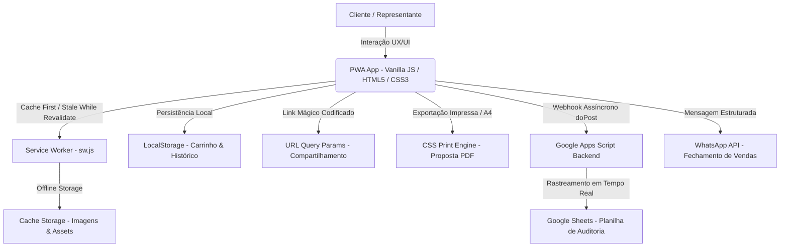

# 🌿 Rawell Química — Catálogo Digital & Plataforma Comercial V2.0

<div align="center">


-10b981?style=for-the-badge)


**Plataforma comercial e catálogo digital inteligente, desenvolvido para alta performance no campo e no desktop, com suporte a cotações em tempo real, propostas timbradas em PDF, motor de descontos dinâmico e rastreamento de auditoria antifraude.**

[🚀 Acessar Demonstração](#-deploy--hospedagem) • [📱 Recursos PWA](#-pwa--offline-first) • [💰 Motor Comercial](#-motor-comercial--sistema-de-descontos-dinâmicos) • [🛡️ Auditoria Antifraude](#-auditoria-antifraude--rastreamento-google-sheets) • [📋 Guia de Configuração](#-guia-de-configuração-rápida)

---

</div>

## 📑 Índice
- [Visão Geral](#-visão-geral)
- [Destaques da Versão 2.0](#-destaques-da-versão-20)
- [Arquitetura e Stack Tecnológica](#-arquitetura-e-stack-tecnológica)
- [Mecânicas e Funcionalidades Detalhadas](#-mecânicas-e-funcionalidades-detalhadas)
  - [1. Progressive Web App (PWA) & Offline First](#1-progressive-web-app-pwa--offline-first)
  - [2. Design System Premium & UX Mobile-First](#2-design-system-premium--ux-mobile-first)
  - [3. Motor de Busca e Filtragem Inteligente](#3-motor-de-busca-e-filtragem-inteligente)
  - [4. Ficha Consultiva Técnica (3 Pilares do Especialista)](#4-ficha-consultiva-técnica-3-pilares-do-especialista)
  - [5. Motor Comercial & Descontos Dinâmicos](#5-motor-comercial--descontos-dinâmicos)
  - [6. Carrinho Inteligente & Cart Footer Bar](#6-carrinho-inteligente--cart-footer-bar)
  - [7. Proposta Comercial em PDF Timbrado Oficial](#7-proposta-comercial-em-pdf-timbrado-oficial)
  - [8. Link Mágico de Compartilhamento & Recompra](#8-link-mágico-de-compartilhamento--recompra)
  - [9. Histórico de Orçamentos & Dashboard Local](#9-histórico-de-orçamentos--dashboard-local)
  - [10. Modo Representante com Acesso Seguro por PIN](#10-modo-representante-com-acesso-seguro-por-pin)
  - [11. Auditoria Antifraude e Rastreamento em Tempo Real](#11-auditoria-antifraude-e-rastreamento-em-tempo-real)
  - [12. Estúdio de Flyers e Stories para Redes Sociais](#12-estúdio-de-flyers-e-stories-para-redes-sociais)
- [Estrutura de Pastas do Repositório](#-estrutura-de-pastas-do-repositório)
- [Guia de Configuração Rápida](#-guia-de-configuração-rápida)
- [Deploy e Hospedagem](#-deploy--hospedagem)
- [Changelog](#-changelog)
- [Licença e Direitos](#-licença-e-direitos)

---

## 🎯 Visão Geral

O **Catálogo Digital Rawell Química 2026** é uma aplicação web progressiva desenvolvida para atender as necessidades de representantes comerciais, agrônomos, revendas agropecuárias e clientes finais. 

Construído com foco em **zero dependências externas pesadas**, ele carrega instantaneamente mesmo em conexões rurais 2G/3G ou completamente offline, permitindo a consulta completa de defensivos seletivos, desinfestantes, fungicidas, inseticidas e raticidas, além da elaboração imediata de pedidos com envio formatado para o WhatsApp e emissão de propostas formais em PDF.

---

## ⚡ Destaques da Versão 2.0

* 🚀 **Motor de Descontos Dinâmicos**: Aplicação de descontos por item (%) e desconto global no pedido com chips de acesso rápido (5%, 10%, 15%).
* 💰 **Edição de Preços em Tempo Real**: Vendedores autenticados podem personalizar valores unitários no carrinho com recálculo automático de margens.
* 📄 **Proposta Comercial A4 Oficial**: Exportação instantânea de proposta timbrada, com numeração única (`RQ-2026-XXXX`), tabela de produtos, prazos e condições comerciais.
* 🔍 **Split Modal no Desktop**: Visualização ampla em 2 colunas com galeria em alta definição e ficha técnica agronômica.
* 🛡️ **Auditoria Google Apps Script Atualizada**: Discriminação de tráfego por canal (`Vendedor` vs `Base Orgânica`) e registro de links de garantia na planilha.
* 📋 **Dashboard de Histórico**: Armazenamento local de cotações para rápida consulta, reenvio e recompra com 1 clique.

---

## 🛠️ Arquitetura e Stack Tecnológica



* **Core Frontend**: HTML5 Semântico, CSS3 Moderno (Custom Properties, Flexbox, CSS Grid), Vanilla JavaScript (ES6+ modular).
* **PWA & Offline**: Service Worker nativo com estratégias de cache para 32+ produtos e imagens WebP de alta fidelidade.
* **Backend Serverless**: Webhook em Google Apps Script (`doPost`/`doGet`) com lock de concorrência (`LockService`).
* **Design & Tipografia**: Fontes *Plus Jakarta Sans* e *Inter*, ícones vetoriais SVG e microvibração tátil via `navigator.vibrate`.

---

## 💎 Mecânicas e Funcionalidades Detalhadas

### 1. Progressive Web App (PWA) & Offline First
* **Instalação Nativa**: Compatível com Android (WebAPK), iOS (Adicionar à Tela de Início com meta tags dedicadas) e Desktop (Chrome/Edge).
* **Operação em Modo Avião / Sem Sinal**: O `sw.js` realiza o pré-cache de todo o catálogo, imagens de produtos, folhas de estilo e ícones. Se o usuário estiver no campo sem sinal de internet, o catálogo abre instantaneamente com todas as informações e fotos.
* **Atualização em Segundo Plano**: Estratégia inteligente que serve a versão em cache imediatamente e atualiza silenciosamente quando houver conexão.

### 2. Design System Premium & UX Mobile-First
* **Suporte a Dark Mode / Light Mode**: Detecção automática de preferência de sistema (`prefers-color-scheme`) e alternador manual com persistência de tema.
* **Alternador de Layouts**: Alternância com um clique entre visualização em **Grade (Cards)** ou **Lista Compacta**.
* **Microinterações Hápticas**: Feedback vibratório tátil ao adicionar itens, alterar quantidades, aplicar descontos ou alternar abas.
* **Safe Area Insets**: Totalmente adaptado para entalhes de tela, bordas curvas e barras de navegação de iPhones e smartphones modernos.

### 3. Motor de Busca e Filtragem Inteligente
* **Busca Preditiva Instantânea**: Pesquisa em tempo real com debounce por:
  - Nome comercial do produto;
  - Princípio Ativo e Formulação;
  - Praga / Alvo biológico (ex: *Tiririca, Lagarta, Formiga, Barata, Rato, Broca*);
  - Cultura indicada (ex: *Gramados, Soja, Milho, Hortaliças, Jardinagem*);
  - Registro no MAPA / Ministério da Saúde / Anvisa.
* **Filtros Independentes por Categoria**: Gramados, Jardinagem Amadora, Saúde Pública, Linha Profissional, Raticidas e Inseticidas.
* **Chips "Mais Buscados"**: Atalhos rápidos para os produtos mais procurados.
* **Estado Vazio Inteligente**: Exibição amigável quando nenhum item é encontrado com botão para resetar filtros com 1 toque.

### 4. Ficha Consultiva Técnica (3 Pilares do Especialista)
* **Pilar 1 — Recomendação Agronômica**: Instruções práticas de aplicação, espectro de ação e dosagens por área ou volume de calda.
* **Pilar 2 — Modo de Ação e Formulação**: Comportamento químico, sistêmico vs. contato, tipo de formulação (SC, WG, CE, Pellets, Gel).
* **Pilar 3 — Segurança e Manejo**: Cartões visuais de EPI, carência, toxicologia e instruções de descarte.
* **Galeria de Fotos Multi-Ângulo**: Visualizador HD com miniaturas clicáveis e transições fluidas sem pulo de layout (*zero layout shift*).

### 5. Motor Comercial & Descontos Dinâmicos
* **Edição Unitária de Preços**: Representantes logados podem alterar o valor base unitário de qualquer item diretamente no carrinho.
* **Descontos por Item (%)**: Desconto percentual exclusivo para produtos específicos, com botões de atalho rápido (5%, 10%, 15%) e botão de remoção rápida.
* **Desconto Global no Pedido (%)**: Aplicação de desconto geral incidente com precisão sobre o saldo elegível de itens que não possuem desconto individual.
* **Transparência Contábil**: Exibição detalhada de:
  - `Subtotal Bruto (Preço de Tabela)`
  - `(-) Desconto nos Itens`
  - `(-) Desconto Global do Pedido`
  - `(=) Total Líquido Final da Negociação`

### 6. Carrinho Inteligente & Cart Footer Bar
* **Drawer Lateral / Bottom Sheet**: Acesso rápido aos itens selecionados, controle de quantidade com incremento/decremento e exclusão intuitiva.
* **Rodapé Fixo Unificado**: Resumo financeiro de fácil leitura com contraste de alta visibilidade.
* **Grade de Ações Secundárias**:
  - `📄 Gerar Proposta Comercial PDF`
  - `🔗 Copiar Link Mágico de Compartilhamento`
  - `💬 Enviar Cotação para o WhatsApp`
  - `🗑️ Limpar Carrinho`

### 7. Proposta Comercial em PDF Timbrado Oficial
* **Documento Corporativo A4**: Geração instantânea de documento comercial formal diretamente pelo navegador (`window.print()`).
* **Estrutura da Proposta**:
  - Cabeçalho timbrado com logo oficial da Rawell Química, CNPJ, Razão Social e canais de atendimento;
  - Número de identificação único (`RQ-2026-XXXX`);
  - Dados do Cliente e Representante Responsável;
  - Tabela organizada com Código, Referência, Nome, Dosagem, Quantidade, Valor Unitário e Subtotais;
  - Condições de Pagamento, Prazo de Validade (10 dias) e Prazos de Entrega;
  - QR Code e Link Direto para reabertura digital da proposta.

### 8. Link Mágico de Compartilhamento & Recompra
* **Serialização de Estado via URL**: Toda a montagem do carrinho, quantidades, preços customizados, descontos e vendedor selecionado são compactados em parâmetros de URL.
* **Recompra e Reabertura Imediata**: Qualquer pessoa que abrir o link tem o carrinho exatamente reconstruído no seu próprio navegador, sem precisar de banco de dados ou login prévio.

### 9. Histórico de Orçamentos & Dashboard Local
* **Armazenamento Persistente**: Salva localmente cada cotação gerada com timestamp, nome do cliente, documento, lista de itens e link de recompra.
* **Painel de Meus Orçamentos**: Permite que o representante ou cliente consulte cotações anteriores, verifique detalhes e recarregue o pedido com um único clique.

### 10. Modo Representante com Acesso Seguro por PIN
* **Controle de Visualização**: Preços de tabela e campos de negociação financeira ficam ocultos por padrão para o público geral, sendo liberados apenas após a autenticação por PIN.
* **Roteamento Dinâmico de Atendimento**: Se um vendedor estiver selecionado, os botões de envio direcionam a mensagem automaticamente para o WhatsApp direto do vendedor cadastrado.

### 11. Auditoria Antifraude e Rastreamento em Tempo Real
* **Integração Google Apps Script**: Webhook HTTP conectado ao Google Sheets para gravar todas as movimentações comerciais.
* **Rastreamento de Origem de Vendas**: Discriminação automática entre solicitações originadas por representantes ou tráfego orgânico da base.
* **Link de Backup com Preço**: Grava na planilha a URL com os preços exatos cotados, servindo como **comprovante auditável** de negociações.

### 12. Estúdio de Flyers e Stories para Redes Sociais
* **Gerador de Imagens Promocionais**: Ferramenta embutida para criação de banners no formato Stories (9:16) prontos para postagem no WhatsApp Status e Instagram, com foto do produto, características e identidade visual da Rawell Química.

---

## 📁 Estrutura de Pastas do Repositório

```text
VALDECIR/
├── nfog-catalogo/                   # 🌿 Repositório Principal (Git)
│   ├── v2/                          # 🚀 Versão 2.0 (Plataforma Comercial Completa)
│   │   ├── img/                     # Imagens dos produtos, ícones PWA e logos
│   │   ├── GUIA-AUDITORIA-GOOGLE-SHEETS.md  # Manual de ativação do webhook
│   │   ├── google-apps-script.js    # Código fonte do backend para Google Sheets
│   │   ├── index.html               # Aplicação Principal V2.0
│   │   ├── manifest.json            # Manifesto PWA da Versão 2
│   │   └── sw.js                    # Service Worker V2 com cache offline
│   ├── css/                         # Folhas de estilo modulares
│   ├── js/                          # Scripts auxiliares e dados de catálogo
│   ├── img/                         # Assets globais de imagens
│   ├── index.html                   # Entrada principal do catálogo
│   ├── manifest.json                # Manifesto PWA raiz
│   ├── sw.js                        # Service Worker raiz
│   └── README.md                    # 📖 Documentação Oficial do Projeto
```

---

## ⚙️ Guia de Configuração Rápida

### 1. Configurar Dados da Empresa e WhatsApp
No arquivo `v2/index.html`, localize o bloco de configuração:

```javascript
const CONFIG = {
  whatsapp: '5545999332563', // WhatsApp Central da Rawell Química
  empresa: 'Rawell Química — Catálogo 2026',
  mensagem_intro: 'Olá! Gostaria de solicitar uma cotação dos seguintes produtos da Rawell Química:',
  mensagem_fim: '✅ Aguardo retorno sobre disponibilidade e condições de fornecimento. Obrigado!',
  auditWebhookUrl: 'https://script.google.com/macros/s/SEU_SCRIPT_ID/exec' // URL do Google Apps Script
};
```

### 2. Ativar a Planilha de Auditoria (Google Sheets)
1. Crie uma nova planilha no [Google Sheets](https://sheets.new).
2. Vá em **Extensões** > **Apps Script** e cole o código de `v2/google-apps-script.js`.
3. Clique em **Implantar** > **Nova Implantação** > Tipo: **App da Web**.
4. Configure *Quem pode acessar* como **Qualquer pessoa** e confirme a autorização.
5. Copie a URL gerada e insira no campo `auditWebhookUrl` do `CONFIG`.
6. *(Para o guia detalhado, consulte o arquivo `v2/GUIA-AUDITORIA-GOOGLE-SHEETS.md`)*.

---

## 🌐 Deploy e Hospedagem

O projeto é 100% estático e pode ser hospedado gratuitamente e com deploy contínuo em qualquer plataforma:

### Opção 1: Render (Recomendado)
- **Tipo de Serviço**: Static Site
- **Build Command**: *(Deixe em branco)*
- **Publish Directory**: `.` (ou `v2`)

### Opção 2: GitHub Pages
- Vá nas configurações do repositório no GitHub > **Pages**.
- Selecione a branch `main` e a pasta `/ (root)` e salve.

### Opção 3: Vercel / Netlify / Cloudflare Pages
- Basta conectar o repositório GitHub e realizar o deploy automático sem necessidade de build.

---

## 📜 Changelog

### [v2.0.0] - 2026-09-02
* ✨ **Motor de Descontos Dinâmicos**: Desconto individual por item (%) e desconto global no pedido com chips de 5%, 10% e 15%.
* 💰 **Negociação em Tempo Real**: Edição de valor unitário no carrinho para representantes.
* 📄 **Proposta Comercial em PDF Timbrado**: Exportação formal com layout A4 timbrado e numeração `RQ-2026-XXXX`.
* 🛡️ **Auditoria Anti-Fraude Aprimorada**: Rastreamento por canal (`Vendedor` vs `Base Orgânica`) e links de garantia na planilha.
* 📋 **Dashboard de Histórico**: Gestão local de orçamentos gerados com reabertura de carrinho em 1 clique.
* 🔍 **Split Modal no Desktop**: Visualização ampla de galeria HD + ficha agronômica em 2 colunas.

### [v1.2.0] - 2026-09-02
* 🌾 **Ficha Consultiva 3 Pilares**: Recomendações técnicas, modo de ação e segurança para todos os produtos.
* 🔒 **Modo Representante com PIN**: Acesso restrito a preços de tabela e margens.

### [v1.0.0] - 2026-08-28
* 📱 **Lançamento Inicial**: Catálogo digital responsivo, PWA com cache offline, galeria interativa e cotação via WhatsApp.

---

<div align="center">

**Rawell Química © 2026** — *Tecnologia e Inovação em Defensivos e Soluções Químicas.*

</div>
