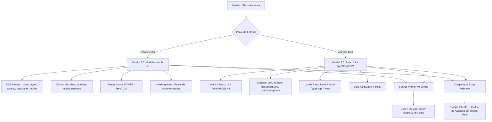

# 🌿 JCV Química — Catálogo Digital & Plataforma Comercial Inteligente 2026

<div align="center">


-10b981?style=for-the-badge)


**Plataforma comercial e catálogo digital inteligente, desenvolvido para alta performance no campo e no desktop. Inclui suporte a cotações em tempo real, emissão de propostas timbradas em PDF, motor de descontos dinâmico, física de gestos mobile, painel interativo de roadmap e auditoria antifraude via Google Sheets.**

[🚀 Acessar Catálogo V2 (Modular)](#-versão-20-modular-vanilla-js) • [⚡ Acessar Catálogo V3 (React SPA)](#-versão-30-react-19--typescript-spa) • [📊 Painel de Implementações / Roadmap](#-painel-de-implementações--roadmap-interativo) • [💰 Motor Comercial](#-motor-comercial--descontos-dinâmicos) • [🛡️ Auditoria](#-auditoria-antifraude--rastreamento-google-sheets)

---

</div>

## 📑 Índice
- [Visão Geral & Proposta de Valor](#-visão-geral--proposta-de-valor)
- [Arquitetura Dupla (Dual Architecture)](#-arquitetura-dupla-dual-architecture)
  - [Versão 2.0 (Modular Vanilla JS — Ultra Leve & Zero Dependências)](#-versão-20-modular-vanilla-js)
  - [Versão 3.0 (React 19 + TypeScript + Tailwind CSS v4 + Zustand)](#-versão-30-react-19--typescript-spa)
- [Painel de Implementações & Roadmap Interativo](#-painel-de-implementações--roadmap-interativo)
- [Mecânicas e Funcionalidades Detalhadas](#-mecânicas-e-funcionalidades-detalhadas)
  - [1. Progressive Web App (PWA) & Offline First](#1-progressive-web-app-pwa--offline-first)
  - [2. Física de Gestos Touch & UX Mobile App](#2-física-de-gestos-touch--ux-mobile-app)
  - [3. Motor Comercial & Descontos Dinâmicos](#3-motor-comercial--descontos-dinâmicos)
  - [4. App do Vendedor Master & Gestão de Cotações](#4-app-do-vendedor-master--gestão-de-cotações)
  - [5. Matriz de Ações Estratégicas (Com vs Sem Preço)](#5-matriz-de-ações-estratégicas-com-vs-sem-preço)
  - [6. Proposta Comercial em PDF Timbrado Oficial (A4)](#6-proposta-comercial-em-pdf-timbrado-oficial-a4)
  - [7. Ficha Consultiva Técnica (3 Pilares do Especialista)](#7-ficha-consultiva-técnica-3-pilares-do-especialista)
  - [8. Motor de Busca Preditivo & Filtros Cruzados](#8-motor-de-busca-preditivo--filtros-cruzados)
  - [9. Auditoria Antifraude e Rastreamento em Tempo Real](#9-auditoria-antifraude-e-rastreamento-em-tempo-real)
  - [10. Estúdio de Marketing & Stories](#10-estúdio-de-marketing--stories)
- [Estrutura de Diretórios do Repositório](#-estrutura-de-diretórios-do-repositório)
- [Guia de Configuração e Instalação](#-guia-de-configuração-e-instalação)
- [Deploy e Hospedagem](#-deploy--hospedagem)
- [Changelog Histórico](#-changelog-histórico)
- [Licença e Direitos](#-licença-e-direitos)

---

## 🎯 Visão Geral & Proposta de Valor

O **Ecossistema Digital JCV Química 2026** é uma solução corporativa desenvolvida sob medida para representantes técnicos de vendas, agrônomos, revendas agropecuárias e produtores rurais.

O projeto foi arquitetado para resolver o principal gargalo do setor agroquímico: **a falta de conectividade estável no campo**. Com tecnologia **Offline-First**, a plataforma permite consultar 32+ formulações, calcular dosagens, simular margens financeiras, gerar propostas timbradas e disparar orçamentos via WhatsApp mesmo sem sinal de internet.

---

## 🏛️ Arquitetura Dupla (Dual Architecture)

O repositório oferece **duas implementações de alto padrão**, atendendo tanto a cenários de máxima simplicidade e velocidade estática quanto a ecossistemas corporativos reativos com TypeScript:



### 🌿 Versão 2.0 (Modular Vanilla JS)
* **Diretório:** [`v2/`](file:///c:/Users/n4fog/Pictures/VALDECIR/nfog-catalogo/v2)
* **Stack:** Vanilla JavaScript ES6+ Modular, HTML5 Semântico, CSS3 com Custom Properties.
* **Autonomia Total:** Inclui fontes locais WOFF2 (`Inter` e `Plus Jakarta Sans`), eliminando dependências de CDNs ou conexões externas.
* **Vantagem:** Carregamento em menos de 0.3s, compatível com qualquer servidor estático ou Webview móvel.

### ⚡ Versão 3.0 (React 19 + TypeScript SPA)
* **Diretório:** [`v3/`](file:///c:/Users/n4fog/Pictures/VALDECIR/nfog-catalogo/v3)
* **Stack:** Vite 6, React 19, TypeScript 5.7, Tailwind CSS v4, Zustand e Lucide Icons.
* **Tipagem Estrita:** Interfaces TypeScript para produtos, itens de carrinho, sessões de vendedor e payloads de telemetria.
* **Vantagem:** Altamente escalável, componentes tipados e build pré-compilado em `v3/dist/`.

---

## 📊 Painel de Implementações & Roadmap Interativo

Localizado em [`v2/roadmap.html`](file:///c:/Users/n4fog/Pictures/VALDECIR/nfog-catalogo/v2/roadmap.html) (atalho em [`v2/status.html`](file:///c:/Users/n4fog/Pictures/VALDECIR/nfog-catalogo/v2/status.html)):

* **Dashboard Visual em Tempo Real**: Métricas de progresso global circular (%), contadores por status e timeline cronológica.
* **Filtros e Busca de Funcionalidades**: Filtragem por *Concluído*, *Em Andamento*, *Homologação* e *Planejado*.
* **Área Administrativa Segura com PIN**: Permite cadastrar, editar status e adicionar novas entregas diretamente pela interface.
* **Transparência Corporativa**: Link compartilhável para acompanhamento direto da diretoria e clientes.

---

## 💎 Mecânicas e Funcionalidades Detalhadas

### 1. Progressive Web App (PWA) & Offline First
* **Instalação Nativa**: Suporte a WebAPK no Android, prompt para desktop (Chrome/Edge) e guia inteligente ilustrado para Safari no iOS.
* **Cache Storage Inteligente (`sw.js`)**: Pré-carregamento automático de todos os módulos CSS, JS, fontes locais e imagens WebP dos 32 produtos.
* **Operação no Campo / Modo Avião**: Abertura instantânea do catálogo e montagem de pedidos mesmo sem qualquer conexão à internet.

### 2. Física de Gestos Touch & UX Mobile App
* **Swipe-to-Close com Resistência Elástica**: Fechamento por gesto de arrasto para baixo nas Bottom Sheets com física realista e vibração háptica (`v2/js/modules/mobile-gestures.js`).
* **Botão Flutuante Dinâmico de Orçamento**: Barra inferior com animação fluida que surge ao adicionar itens no mobile.
* **Monitor de Conectividade**: Indicador visual automático de status Online / Offline no topo da aplicação.

### 3. Motor Comercial & Descontos Dinâmicos
* **Edição de Preços Unitários Base**: Representantes logados podem personalizar valores unitários no carrinho em tempo real.
* **Desconto Individual por Item (%)**: Desconto exclusivo para itens específicos com chips rápidos de 5%, 10% e 15%.
* **Desconto Global no Pedido (%)**: Aplicação de desconto geral incidente sobre a base de itens sem desconto exclusivo.
* **Transparência Contábil**: Resumo detalhado com Subtotal Bruto de Tabela, (-) Desconto nos Itens, (-) Desconto Global e (=) Total Líquido Final.

### 4. App do Vendedor Master & Gestão de Cotações
* **Acesso Seguro por PIN**: Painel exclusivo para representantes comerciais.
* **Aba Meus Orçamentos**: Histórico completo com filtros por status (*Todos, Aguardando, Em Negociação, Fechado, Perdido*).
* **Aba Ferramentas & Links**: Gerador de link exclusivo do vendedor com comissão embutida e calculadora de margens.
* **Navegação Móvel Adaptativa**: Atalho "Área do Vendedor" integrado à barra inferior após autenticação.

### 5. Matriz de Ações Estratégicas (Com vs Sem Preço)
* **WhatsApp**: Disparo com discriminação de preços OU apenas lista de produtos e quantidades.
* **Disparo Direto para Cliente**: Modal com campo para digitar o número de telefone do cliente e enviar sem passar pela central.
* **Links Mágicos de Recompra**: Links diretos com preços negociados travados OU com catálogo padrão.
* **Proposta Comercial em PDF**: Geração de documento timbrado com ou sem valores.

### 6. Proposta Comercial em PDF Timbrado Oficial (A4)
* **Documento Corporativo Timbrado**: Layout oficial formatado para impressão (`window.print()`) e exportação em alta resolução.
* **Estrutura Completa**: Logotipo oficial JCV Química, CNPJ, numeração única (`RQ-2026-XXXX`), dados do cliente e representante, tabela detalhada de defensivos, condições de pagamento, validade de 10 dias e QR Code de reabertura.

### 7. Ficha Consultiva Técnica (3 Pilares do Especialista)
* **Pilar 1 — Recomendação Agronômica**: Alvos biológicos, pragas controladas e dosagens recomendadas por hectare ou calda.
* **Pilar 2 — Modo de Ação e Formulação**: Comportamento químico (sistêmico, contato, residual) e tipo de formulação (SC, WG, CE, Pellets, Gel).
* **Pilar 3 — Segurança e Manejo**: Cartões visuais de EPI, classe toxicológica, intervalo de segurança/carência e descarte de embalagens.
* **Galeria Multi-Ângulo HD**: Visualizador de imagens com transição suave e zero layout shift.

### 8. Motor de Busca Preditivo & Filtros Cruzados
* **Busca Preditiva Instantânea**: Pesquisa por Nome comercial, Princípio Ativo, Praga Alvo, Cultura indicada e Registro MAPA/Anvisa.
* **Filtros por Categoria Independentes**: Gramados, Jardinagem Amadora, Saúde Pública, Linha Profissional, Raticidas e Inseticidas.
* **Atalhos Rápidos**: Chips de busca rápida para os alvos mais procurados (*Tiririca, Roseta, Baratas, Moscas, Cupins, Fungos, Formigas*).

### 9. Auditoria Antifraude e Rastreamento em Tempo Real
* **Webhook Google Apps Script**: Código serverless pronto em [`v2/google-apps-script.js`](file:///c:/Users/n4fog/Pictures/VALDECIR/nfog-catalogo/v2/google-apps-script.js).
* **Rastreamento por Canal**: Identificação automática de origem (*Vendedor Vinculado* vs *Base Orgânica*).
* **Prova de Cotação Irrefutável**: Gravação de links diretos com os valores exatos cotados pelo vendedor na planilha.

### 10. Estúdio de Marketing & Stories
* **Artes Promocionais 9:16**: Conjunto de banners prontos em [`v2/img/marketing/`](file:///c:/Users/n4fog/Pictures/VALDECIR/nfog-catalogo/v2/img/marketing) para publicação no WhatsApp Status e redes sociais.

---

## 📁 Estrutura de Diretórios do Repositório

```text
VALDECIR/
├── nfog-catalogo/                   # 🌿 Repositório Principal (Git)
│   ├── v2/                          # 🚀 Versão 2.0 (Modular Vanilla JS — Produção)
│   │   ├── css/                     # Estilos Modulares (base, layout, catalog, sheet-modal, cart, seller, mobile-app, roadmap)
│   │   ├── fonts/                   # Fontes Locais WOFF2 (Inter & Plus Jakarta Sans)
│   │   ├── js/                      # JavaScript Modular (data/, modules/, roadmap*)
│   │   ├── img/                     # Imagens dos 32 produtos, marketing e ícones PWA
│   │   ├── GUIA-AUDITORIA-GOOGLE-SHEETS.md  # Manual do webhook Google Sheets
│   │   ├── google-apps-script.js    # Código fonte do backend para Google Sheets
│   │   ├── index.html               # Aplicação Principal V2.0
│   │   ├── roadmap.html             # Painel Interativo de Implementações
│   │   ├── status.html              # Redirecionador rápido para o roadmap
│   │   ├── manifest.json            # Manifesto PWA
│   │   └── sw.js                    # Service Worker V5 Offline
│   │
│   ├── v3/                          # ⚡ Versão 3.0 (React 19 + TypeScript + Vite)
│   │   ├── src/                     # Código-fonte React, Componentes, Zustand Stores e Types
│   │   ├── public/                  # Assets estáticos, manifest e sw.js da V3
│   │   ├── dist/                    # Build de produção pré-compilado otimizado
│   │   ├── vite.config.ts           # Configuração Vite com Tailwind v4
│   │   ├── package.json             # Dependências e scripts
│   │   └── README.md                # Manual técnico da Versão 3
│   │
│   ├── index.html                   # Entrada principal do catálogo
│   ├── manifest.json                # Manifesto PWA raiz
│   ├── sw.js                        # Service Worker raiz
│   └── README.md                    # 📖 Documentação Oficial Unificada
```

---

## ⚙️ Guia de Configuração e Instalação

### 1. Configurar Dados da Empresa e WhatsApp
No arquivo [`v2/js/data/config.js`](file:///c:/Users/n4fog/Pictures/VALDECIR/nfog-catalogo/v2/js/data/config.js) (ou `v3/src/data/config.ts`), personalize os dados corporativos:

```javascript
const CONFIG = {
  whatsapp: '554599781407', // WhatsApp Comercial JCV Química
  empresa: 'JCV Química — Catálogo de Produtos 2026',
  mensagem_intro: 'Olá! Gostaria de solicitar uma cotação dos seguintes produtos através do catálogo JCV Química:',
  mensagem_fim: '✅ Aguardo retorno sobre disponibilidade e condições de fornecimento. Obrigado!',
  auditWebhookUrl: 'https://script.google.com/macros/s/SEU_SCRIPT_ID/exec'
};
```

### 2. Executar Localmente
* **Versão 2 (Vanilla):** Basta abrir o arquivo `v2/index.html` em qualquer navegador ou via extensão *Live Server*.
* **Versão 3 (React SPA):**
  ```bash
  cd v3
  npm install
  npm run dev
  ```

---

## 🌐 Deploy e Hospedagem

O projeto é 100% estático e pode ser publicado instantaneamente:

### Opção 1: Render (Recomendado)
- **Tipo de Serviço**: Static Site
- **Build Command**: *(Deixe em branco)*
- **Publish Directory**: `v2` (para a versão Vanilla) ou `v3/dist` (para a versão React SPA).

### Opção 2: GitHub Pages
- Configurações do Repositório > **Pages** > Branch: `main` > Pasta: `/ (root)` ou `/v2`.

### Opção 3: Vercel / Netlify / Cloudflare Pages
- Conecte o repositório GitHub e selecione o diretório raiz desejado.

---

## 📜 Changelog Histórico

### [v3.0.0] - 2026-09-05 (🏆 Lançamento Dual Architecture)
* 🚀 **Integração V3 React SPA**: Vite 6, React 19, TypeScript, Tailwind CSS v4, Zustand e build pré-compilado em `v3/dist/`.
* 📊 **Painel de Implementações & Roadmap**: `v2/roadmap.html` interativo com métricas de progresso, timeline e área administrativa.
* 📱 **Física de Gestos Touch Mobile**: Swipe-to-close em Bottom Sheets, botão flutuante e monitor de conectividade online/offline.
* 🔤 **Fontes Locais Self-Hosted**: Inclusão de `Inter` e `Plus Jakarta Sans` em WOFF2 para 100% de autonomia offline.
* 🏢 **Identidade JCV Química**: Dados comerciais atualizados e roteamento de WhatsApp comercial.

### [v2.1.0] - 2026-09-04
* 💼 **App do Vendedor Master**: Painel interno de orçamentos, ações com/sem preço e disparo direto para WhatsApp de clientes.

### [v2.0.0] - 2026-09-02
* ✨ **Motor de Descontos Dinâmicos**: Descontos por item (%) e desconto global no pedido.
* 📄 **Proposta Comercial A4 Timbrada**: Exportação em PDF corporativo timbrado.

---

<div align="center">

**JCV Química © 2026** — *Tecnologia e Inovação em Defensivos e Soluções Químicas.*

</div>
